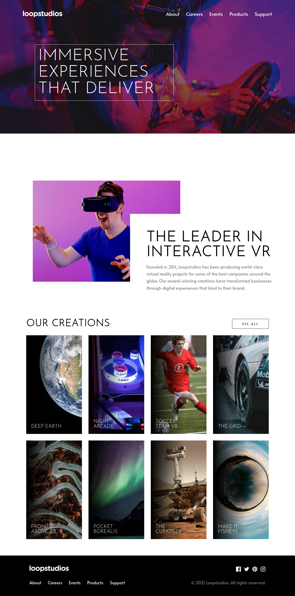

# Overview

This is a solution to the [Loopstudios landing page challenge on Frontend Mentor](https://www.frontendmentor.io/challenges/loopstudios-landing-page-N88J5Onjw).

The website was done using only:
- Semantic HTML5 markup
- SASS preprocessor
- BEM naming convention
- Mobile-first workflow

## Screenshot

## Link to Website (hosted with GitHub Pages)

- [Frontend Mentor Solution URL](https://www.frontendmentor.io/solutions/loopstudios-landing-page-using-sass-a5KpuAs5KV)
- [Live Site URL - Netlify](https://cristian-nastase-loopstudios.netlify.app/)

## Author
- GitHub: https://github.com/Cristian-Nastase
- Frontend Mentor: https://www.frontendmentor.io/profile/Cristian-Nastase
